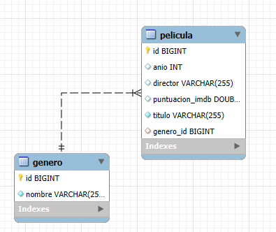

# 🎥 Movie Repository API

Welcome to your **Movie REST API**! This application lets you manage a movie repository connected to both MySQL and PostgreSQL databases, with full CRUD operations available and tested via Postman.

---

## 📖 Overview

- **API Type**: RESTful  
- **Functionality**:  
  - Create, Read, Update, and Delete movies  
  - Movie fields: `title`, `director`, `year`, `imdbRating`, `genre`  
- **Databases**:  
  - MySQL (initial)  
  - PostgreSQL (effective migration)  
- **Testing**: all endpoints tested with Postman  

---

## 🛠 Technologies

- **Language & Framework**: Java / Spring Boot *(or your chosen stack)*  
- **Primary Database**: MySQL  
- **Secondary Database**: PostgreSQL  
- **Testing Tool**: Postman  

## 📐 Entity-Relationship Diagram

> Below is the **Entity-Relationship Diagram** for our movie database.

<figure align="center">
  
  <figcaption><em>Figure 1.</em> ER diagram of the database.</figcaption>
</figure>
